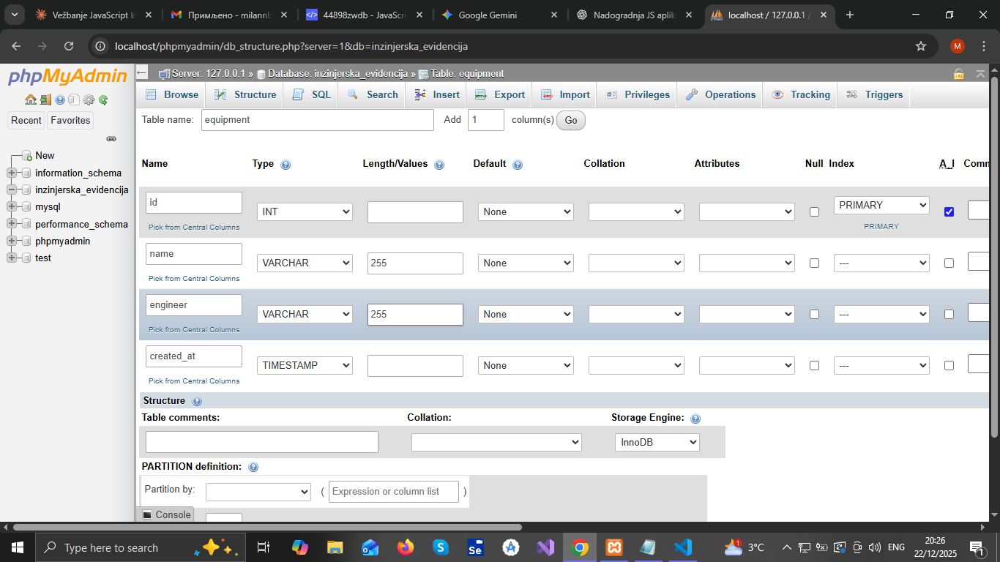
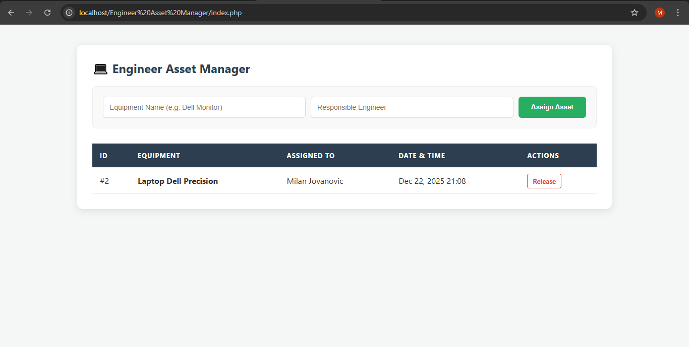
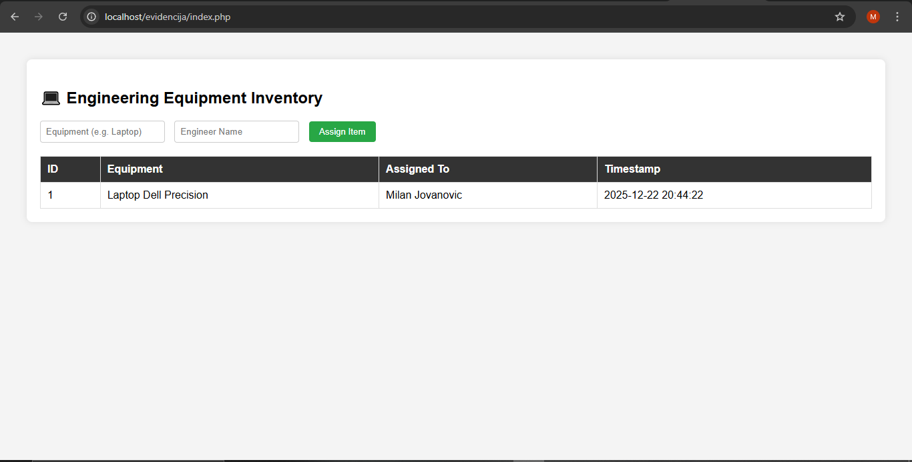

# Engineer Asset Manager v1.0

## Description
A comprehensive PHP/MySQL web application for tracking engineering equipment and asset assignments. This project demonstrates full **CRUD** functionality and database integration.

## QA Engineering Highlights
- **End-to-End Data Validation**: Verifies the complete lifecycle of an asset, from assignment via `add.php` to its release via `release.php`.
- **UI Safety Checks**: Implemented JavaScript confirmation dialogs to validate critical user actions (asset release), demonstrating a focus on preventing accidental data loss.
- **Database Integrity**: Features a robust connection module (`db.php`) with UTF-8 character support and error handling for connection failures.
- **Security Awareness**: Uses POST methods for data submission to ensure secure state-changing operations.

## Tech Stack
- **Backend**: PHP 8.x
- **Database**: MySQL/MariaDB
- **Frontend**: HTML5, CSS3 (Custom Flexbox Grid)

## Installation & Setup
1. Import the database schema from `inzinjerska_evidencija.sql` (if available).
2. Configure credentials in `db.php`.
3. Run on a local server like XAMPP or WAMP.

   ## 📸 Project Preview

### Backend - Database Structure
The application uses a MySQL table `equipment` to manage and track assets.

### Frontend - User Interface
The UI allows engineers to easily assign and release equipment.

